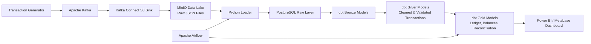

# Digital Wallet Data Platform

An end-to-end **Digital Wallet Data Platform** built as a fintech data engineering case study.

The project simulates wallet transaction events, ingests them through Kafka, lands raw JSON files into MinIO, loads raw data into PostgreSQL, transforms the data with dbt, and builds Silver/Gold analytical models for ledger reconstruction, daily balance snapshots, financial summaries, reconciliation checks, and BI reporting.

## Project Goals

This project focuses on core data engineering problems in financial systems:

- Append-only raw transaction ingestion
- Data quality validation and invalid-record handling
- Deterministic wallet balance calculation from ledger history
- Double-entry logic for wallet-to-wallet transfers
- Daily financial reconciliation
- Analytics-ready Gold models for BI dashboards

## Architecture



## Tech Stack

| Layer           | Technologies                       |
|-----------------|------------------------------------|
| Data Generation | Python                             |
| Streaming       | Apache Kafka, Kafka UI             |
| Raw Landing     | Kafka Connect S3 Sink, MinIO       |
| Warehouse       | PostgreSQL                         |
| Transformation  | dbt, SQL                           |
| Orchestration   | Apache Airflow                     |
| BI / Reporting  | Power BI / Metabase                |
| Infrastructure  | Docker, Docker Compose, PowerShell |

## Repository Structure

```text
.
├── dags/                  # Airflow DAG for pipeline orchestration
├── docs/                  # Business rules, invariants, schema design, balance logic
├── generator/             # Python transaction event generator
├── infra/                 # Docker Compose, Kafka Connect, MinIO sink config
├── loader/                # Python loader from MinIO raw files to PostgreSQL
├── transform/             # dbt project: Bronze, Silver, Gold models and tests
├── .env.example           # Environment variable template
├── run.ps1                # Helper script for platform startup/shutdown
└── README.md
```

## Business Scope

The platform models a single-currency USD digital wallet system.

Supported transaction types:

| Transaction Type | Meaning                                                     |
|------------------|-------------------------------------------------------------|
| `TOPUP`          | Money enters the wallet from an external source             |
| `PURCHASE`       | Money leaves the wallet for payment                         |
| `REFUND`         | Money is returned for a previous purchase                   |
| `TRANSFER`       | Internal wallet-to-wallet movement using double-entry logic |
| `ADJUSTMENT`     | Manual correction with audit reason                         |

Out of scope:

- Multi-currency wallets
- Loyalty or rewards points
- Real-time fraud blocking
- Overdraft / negative balance support

## Data Layers

### Raw / Bronze

Stores raw transaction events landed from Kafka into MinIO and loaded into PostgreSQL.

Main purpose:

- Preserve original JSON payloads
- Keep ingestion metadata
- Support replayability and audit traceability

### Silver

Cleans, parses, and validates raw transactions.

Main responsibilities:

- Type casting
- Deduplication by `transaction_id`
- Amount validation
- Required-field validation
- Transaction status normalization
- Refund reference validation
- Invalid-record quarantine / flagging

### Gold

Builds business-facing financial models.

Main outputs:

- Immutable ledger entries
- Daily wallet balance snapshots
- Daily financial summaries
- Reconciliation results
- BI-ready reporting tables

## Key Data Quality Rules

The platform applies validation rules such as:

- `transaction_id` must be unique
- `amount` must be greater than zero
- Required fields must not be null
- `REFUND` transactions must reference a valid previous purchase
- `TRANSFER` transactions must produce balanced debit and credit entries
- Derived wallet balance must not become negative
- Invalid transactions are excluded from Gold financial outputs

## Balance Logic

Wallet balances are not directly updated or treated as the source of truth.

Instead, balances are derived from ledger entries:

```text
Balance = Sum(CREDIT amounts) - Sum(DEBIT amounts)
```

Daily balance snapshots are calculated from historical ledger movements, making the final account balance reproducible from transaction history.

Recommended ledger convention:

- `amount` is stored as a positive value.
- `direction` identifies whether the movement is `DEBIT` or `CREDIT`.
- `signed_amount` can be derived as a reporting/calculation field.

## Reconciliation Logic

The Gold layer includes reconciliation models to verify financial consistency.

Examples:

- Compare total debit and credit movements
- Check transfer debit-credit balancing
- Count invalid or quarantined transactions
- Identify unresolved financial differences
- Produce daily reconciliation status

## Orchestration

Apache Airflow coordinates the batch side of the pipeline:

1. Load raw JSON files from MinIO into PostgreSQL
2. Run dbt Bronze models
3. Run dbt Silver models
4. Run dbt Gold models
5. Run dbt tests and reconciliation checks
6. Refresh BI-ready output tables

## BI Dashboard

Phase 8 adds a reporting layer connected to the PostgreSQL Gold models.

The dashboard is designed to monitor:

- Total transaction volume
- Transaction count by type
- Daily debit and credit movement
- Wallet balance snapshots
- Invalid transaction count
- Reconciliation status
- Transfer balancing issues

Suggested dashboard pages:

| Page                | Purpose                                                            |
|---------------------|--------------------------------------------------------------------|
| Executive Overview  | High-level transaction volume, value, and daily trend              |
| Transaction Quality | Invalid transactions, validation failures, and quarantine summary  |
| Ledger & Balance    | Daily wallet balance movement and ledger-based balance snapshots   |
| Reconciliation      | Debit-credit checks, transfer balancing, and reconciliation status |

## Setup

### 1. Create environment file

Copy the example environment file:

```powershell
Copy-Item .env.example .env
```

Update credentials and connection values if needed.

### 2. Start the platform

```powershell
.\run.ps1 up
```

This starts the local data platform services, including Kafka, MinIO, PostgreSQL, Kafka Connect, and Airflow.

### 3. Stop the platform

```powershell
.\run.ps1 down
```

## Useful Local Services

| Service             | Purpose                            |
|---------------------|------------------------------------|
| Kafka UI            | Monitor Kafka topics and messages  |
| MinIO Console       | Inspect raw landed JSON files      |
| PostgreSQL          | Query Raw, Silver, and Gold tables |
| Airflow UI          | Monitor pipeline orchestration     |
| Power BI / Metabase | Visualize Gold-layer outputs       |

## Roadmap and Progress

| Phase   | Scope                                                      | Status      |
|---------|------------------------------------------------------------|-------------|
| Phase 1 | Business scope and data semantics                          | Completed   |
| Phase 2 | Data model and balance logic design                        | Completed   |
| Phase 3 | Docker infrastructure skeleton                             | Completed   |
| Phase 4 | Transaction generator                                      | Completed   |
| Phase 5 | Kafka ingestion and MinIO landing                          | Completed   |
| Phase 6 | Python loader, dbt Silver/Gold models, data quality checks | Completed   |
| Phase 7 | Airflow orchestration                                      | Completed   |
| Phase 8 | BI dashboard and reporting layer                           | Uncompleted |

## Documentation

Detailed documentation is available in the `docs/` folder:

| Document                    | Description                                                      |
|-----------------------------|------------------------------------------------------------------|
| `docs/problem_and_scope.md` | Business problem, supported transaction types, and project scope |
| `docs/invariants.md`        | System-wide data quality rules and financial invariants          |
| `docs/data_model.md`        | Medallion architecture, ERD, and schema design                   |
| `docs/balance_logic.md`     | Balance derivation and daily snapshot calculation logic          |
| `docs/bi_dashboard.md`      | BI dashboard scope, pages, metrics, and Gold model usage         |

## Project Highlights

- Built a full local data platform using Docker-based infrastructure
- Simulated fintech wallet transactions with valid and invalid cases
- Implemented Kafka-based streaming ingestion into a raw object storage layer
- Loaded append-only raw JSON data into PostgreSQL for ELT processing
- Built dbt Silver models for cleansing, validation, and invalid-record handling
- Built dbt Gold models for ledger entries, balance snapshots, financial summaries, and reconciliation
- Orchestrated loader and dbt workflows with Airflow
- Prepared BI-ready Gold tables for dashboard reporting

## Resume Description

Built an end-to-end data platform for simulated digital wallet transactions, focusing on raw ingestion, data quality control, ledger-based balance calculation, and financial reconciliation.

**Tech Stack:** Python, Apache Kafka, Kafka Connect, MinIO, PostgreSQL, dbt, Apache Airflow, Docker, SQL, PowerShell, Power BI.

**Key Features:**

- Designed a data pipeline for ingesting, validating, transforming, and modeling simulated digital wallet transactions.
- Built a Kafka-based ingestion flow and Python loader to move raw JSON transaction data from MinIO into PostgreSQL with ingestion logging.
- Implemented dbt Silver models for data cleansing, deduplication, validation, and invalid-record quarantine.
- Built Gold models for immutable ledger entries, daily balance snapshots, financial summaries, and reconciliation results.
- Added data quality checks for duplicate transactions, invalid amounts, missing fields, refund references, and transfer debit-credit balancing.
- Prepared BI-ready Gold datasets for financial monitoring and reconciliation dashboards.
