# Digital Wallet Data Platform (Fintech Case Study)

An end-to-end production-grade data platform designed for a single-currency (USD) Digital Wallet. This project focuses on solving core financial data engineering challenges: **Ledger Immutability**, **Deterministic Balance Derivation**, and **Automated Daily Reconciliation**.

---

## Data Architecture (will be drawn completely later)

The platform implements a Medallion Architecture combining real-time streaming ingestion and batch ELT processing:

```mermaid
graph LR
    classDef appStyle fill:#f9f9f9,stroke:#333,stroke-width:2px;
    classDef streamingStyle fill:#e1f5fe,stroke:#0288d1,stroke-width:2px;
    classDef storageStyle fill:#efebe9,stroke:#5d4037,stroke-width:2px;
    classDef dbtStyle fill:#fbe9e7,stroke:#e64a19,stroke-width:2px;
    classDef dbStyle fill:#e8f5e9,stroke:#388e3c,stroke-width:2px;
    classDef biStyle fill:#fffde7,stroke:#fbc02d,stroke-width:2px;

    App["Raw Events (App)"]:::appStyle
    
    subgraph Streaming_Layer ["Streaming Ingestion"]
        Kafka["Apache Kafka"]:::streamingStyle
        KConnect["Kafka Connect <br> (S3 Sink)"]:::streamingStyle
    end

    subgraph Storage_Layer ["Data Lake (Bronze)"]
        MinIO["MinIO <br> (Parquet Files)"]:::storageStyle
    end

    subgraph Transformation_Layer ["Batch ELT (Medallion)"]
        direction TB
        Loader["Python Loader"]:::dbtStyle
        Silver["Silver Stage <br> (Cleaned Data)"]:::dbtStyle
        Gold["Gold Stage <br> (Ledger & Recon)"]:::dbtStyle
        
        Loader --> Silver
        Silver -->|dbt + Postgres| Gold
    end

    subgraph Serving_Layer ["Data Mart / Serving"]
        Postgres[("Postgres <br> (Mart / Serving)")]:::dbStyle
    end

    subgraph BI_Layer ["Visualization"]
        BI["Metabase / PowerBI"]:::biStyle
    end

    App --> Kafka
    Kafka --> KConnect
    KConnect --> MinIO
    MinIO --> Loader
    Gold --> Postgres
    Postgres --> BI

    style Streaming_Layer fill:#f6fafd,stroke:#0288d1,stroke-dasharray: 5 5
    style Storage_Layer fill:#faf8f7,stroke:#5d4037,stroke-dasharray: 5 5
    style Transformation_Layer fill:#fffbfb,stroke:#e64a19,stroke-dasharray: 5 5
    style Serving_Layer fill:#f7fbf7,stroke:#388e3c,stroke-dasharray: 5 5
```



## Documentation:
For detailed business requirements, accounting rules, and constraints:
- [Business Problem and Scopes](docs/problem_and_scope.md)
- [Data Invariants and Quality Rules](docs/invariants.md)
- [Data Model: Schema Design](docs/data_model.md)
- [Data Model: Balance Logic](docs/balance_logic.md)

## Tech Stack and Core Concepts
- Infrastructure: Docker & WSL2 (Ubuntu) for localized environment orchestration.
- Streaming Ingestion: Apache Kafka & Kafka UI for event streaming; Kafka Connect (S3 Sink) for landing raw events.
- Storage / Data Lake: MinIO (S3-compatible object storage) storing append-only historical raw JSON logs.
- Compute / Transformation: PostgreSQL acting as the local Data Warehouse, managed dynamically by dbt (Data Build Tool) for modular SQL modeling, schema isolation, and data lineages.
- Orchestration: Apache Airflow (Standalone) automating and managing dependency workflows.
- Data Quality & Audit: Built-in dbt data tests alongside custom Double-Entry Ledger Reconciliation pipelines.

## Setup
```
# Spin up the entire Data Platform (Kafka, MinIO, Postgres, Airflow)
.\run.ps1 up

# Shut down and clean up resources
.\run.ps1 down
```
- Access the Airflow UI at http://localhost:8085 to monitor the automated pipeline.

## Roadmap and Progress
- **Phase 1: Definition & Data Semantics**
  - [x] 1.1 Business Scope: Defined core entities and 5 transaction types. (`docs/problem_and_scope.md`)
  - [x] 1.2 Invariants Checklist: Formulated data integrity rules. (`docs/invariants.md`)

- **Phase 2: Data Model Layer**
  - [x] 2.1 Schema Design: Drafted Medallion architecture (Bronze/Silver/Gold). (`docs/data_model.md`)
  - [x] 2.2 Balance Logic: Designed pseudo-SQL for historical balance derivation. (`docs/balance_logic.md`)

- **Phase 3: Platform Skeleton (Infra)**
  - [x] 3.1 Repo Setup: Initialized WSL2, directory structure, and environment configs.
  - [x] 3.2 Docker Compose: Containers for Kafka, Kafka Connect, MinIO, and Postgres are up and running.

- **Phase 4: Data Generation**
  - [x] 4.1 Generator Spec: Event JSON v1 schema defined with double-entry and anomaly injection logic.
  - [x] 4.2 Python Producer: Capable of streaming valid/invalid transactions into Kafka.

- **Phase 5: Streaming Ingestion (Data Lake)**
  - [x] 5.1 S3 Sink: Configured Kafka Connect S3 Sink to stream real-time data into MinIO partition by date.
  - [x] 5.2 Observability: Monitoring data pipeline and connector status via Kafka UI.

- **Phase 6: Batch ELT & Data Warehousing (Python + dbt + PostgreSQL)**
  - [x] 6.1 Bronze Layer (Raw Ingestion): Developed an idempotent Python script (`loader/main.py`) to bulk load raw JSON from MinIO to Postgres `raw` schema.
  - [x] 6.2 dbt Environment Setup: Initializing dbt project and configuring `profiles.yml` for PostgreSQL warehouse connection.
  - [x] 6.3 Silver Layer (Transformation): Implement deduplication (handling duplicate UUIDs), filtering negative amounts, and strict type casting using dbt models.
  - [x] 6.4 Gold Layer (Analytics Marts): Build double-entry ledger reconstruction and daily financial volume aggregations.
  - [x] 6.5 Data Quality & Auditing: Pass automated dbt tests (`unique`, `not_null`, `accepted_values`) and data reconciliation logic.

- **Phase 7: Pipeline Orchestration**
  - [x] 7.1 DAG Scheduling: Automate and orchestrate the Python loader and dbt transformation runs via Apache Airflow.

- **Phase 8: Business Intelligence & Visualization**
  - [ ] 8.1 Financial Dashboard: Connect Metabase/PowerBI to PostgreSQL Gold layer to build a real-time audit monitor.

## Convention Commits Rule
- [FEAT] - New features/pipelines.
- [FIX] - Bug fixes.
- [CONFIG] - Infra or project setup updates.
- [DOCS] - Documentation updates.
- [TEST] - Adding/updating quality tests.
- [REFACTOR] - Code restructuring without logic changes.