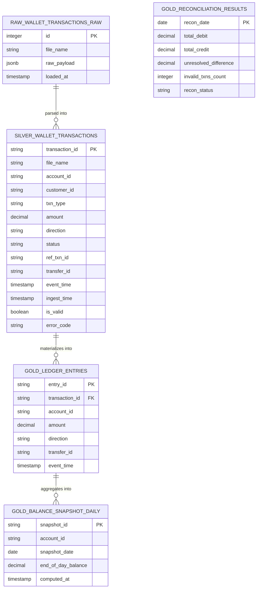

# Data Model & Schema Design

## Document Changelog

| Version | Author  | Description                                                          |
|:--------|:--------|:---------------------------------------------------------------------|
| v1.0    | Litaaya | Initial Medallion schema design and ERD layout                       |
| v1.1    | Litaaya | Sync db table and bronze layer structure _ solve conflict convention |

---

## 1. Architecture Overview (Medallion Layers)

The platform processes transaction data through three progressive layers to ensure separation of concerns, high performance, and absolute auditability:

1. **Bronze Layer (Raw):** Stores exact, unaltered JSON events directly from Kafka. Append-only, partitioned by date.
2. **Silver Layer (Cleaned & Validated):** Parses JSON into typed columns, handles deduplication, applies data quality flags, and normalizes signs.
3. **Gold Layer (Business & Audit Marts):** Enforces Double-Entry ledger constraints, daily analytical snapshots, and automated reconciliation logging.

---

## 2. Entity-Relationship Diagram (ERD)


## 3. Detailed Schema Specifications (DDL Drafts)

### 3.1. Bronze Layer: `bronze_wallet_event`

- Purpose: Low-latency landing zone for raw Kafka streams
- Format: Stored as Parquet/Json files in MinIO

| Column Name | Data Type | Constraints | Description                                        |
|:------------|:----------|:------------|:---------------------------------------------------|
| id          | SERIAL    | PRIMARY KEY | Auto-incrementing identifier for database storage  |
| file_name   | VARCHAR   | NOT NULL    | Origin source file name from MinIO data lake       |
| raw_payload | JSONB     | NOT NULL    | Complete, unparsed JSONB object from Kafka stream  |
| loaded_at   | TIMESTAMP | DEFAULT     | Current timestamp when Python loader writes to DB  |

### 3.2. Silver Layer: `silver_wallet_transactions`

- Purpose: Structured, cleaned and deduplicated transactions. Filtered against data quality rules

```sql
CREATE TABLE silver_wallet_transactions (
    transaction_id VARCHAR PRIMARY KEY,
    file_name VARCHAR NOT NULL,
    account_id VARCHAR,
    customer_id VARCHAR,
    txn_type VARCHAR,          -- TOPUP, PURCHASE, REFUND, TRANSFER, ADJUSTMENT
    amount DECIMAL(18, 4),     -- Always absolute and positive
    direction VARCHAR,         -- CREDIT or DEBIT
    status VARCHAR,            -- SUCCESS, FAILED
    ref_txn_id VARCHAR,        -- Nullable, used for REFUND
    transfer_id VARCHAR,       -- Nullable, used to group TRANSFER pairs
    event_time TIMESTAMP,
    ingest_time TIMESTAMP,
    is_valid BOOLEAN,          -- False if violates any invariant
    error_code VARCHAR         -- e.g., 'NEG_AMOUNT', 'DUP_TXN'
);
```

### 3.3. Gold Layer: `gold_ledger_entries`

- Purpose: The absolute financial source of truth. Implements double-entry style ledger lines

```sql
CREATE TABLE gold_ledger_entries (
    entry_id VARCHAR PRIMARY KEY,      -- Generated UUID per ledger row
    transaction_id VARCHAR NOT NULL,   -- Maps back to Silver transaction
    account_id VARCHAR NOT NULL,
    amount DECIMAL(18, 4) NOT NULL,    -- Always absolute and positive (Accounting standard)
    direction VARCHAR NOT NULL,         -- CREDIT or DEBIT
    transfer_id VARCHAR,               -- Populated for internal transfers
    event_time TIMESTAMP NOT NULL
);
```

### 3.4 Gold Layer: `gold_balance_snapshot_daily`
- Purpose: Cached End-of-Day (EOD) balance per account to optimize analytical queries.

```sql
CREATE TABLE gold_balance_snapshot_daily (
    snapshot_id VARCHAR PRIMARY KEY,   -- Format: account_id + date
    account_id VARCHAR NOT NULL,
    snapshot_date DATE NOT NULL,
    end_of_day_balance DECIMAL(18, 4) NOT NULL,
    computed_at TIMESTAMP DEFAULT CURRENT_TIMESTAMP
);
```

### 3.5 Gold Layer: `gold_reconciliation_results`

- Purpose: Continuous operational audit logs monitoring ecosystem balancing state.

```sql
CREATE TABLE gold_reconciliation_results (
    recon_date DATE PRIMARY KEY,
    total_debit DECIMAL(18, 4) NOT NULL,       -- Sum of all DEBIT entries on date
    total_credit DECIMAL(18, 4) NOT NULL,      -- Sum of all CREDIT entries on date
    unresolved_difference DECIMAL(18, 4),     -- Calculated as (total_credit - total_debit), strictly equals 0
    invalid_txns_count INT DEFAULT 0,          -- Count of rejected transactions from Silver
    recon_status VARCHAR NOT NULL              -- 'PASS' or 'FAILED'
);
```